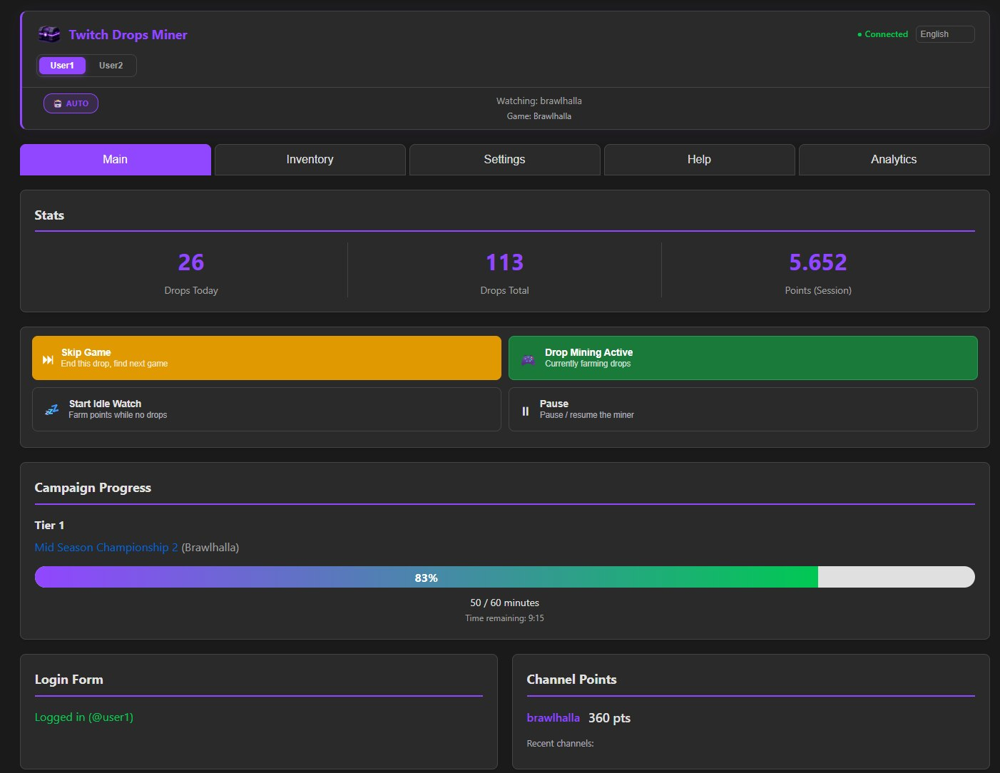
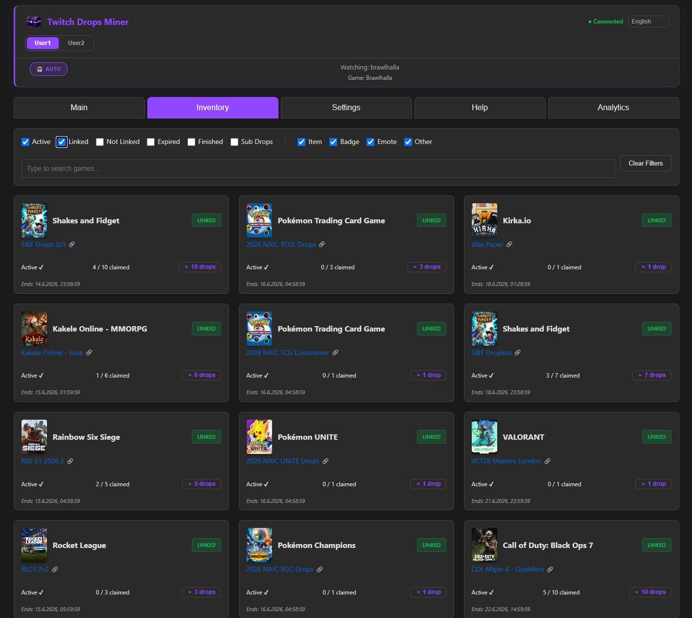
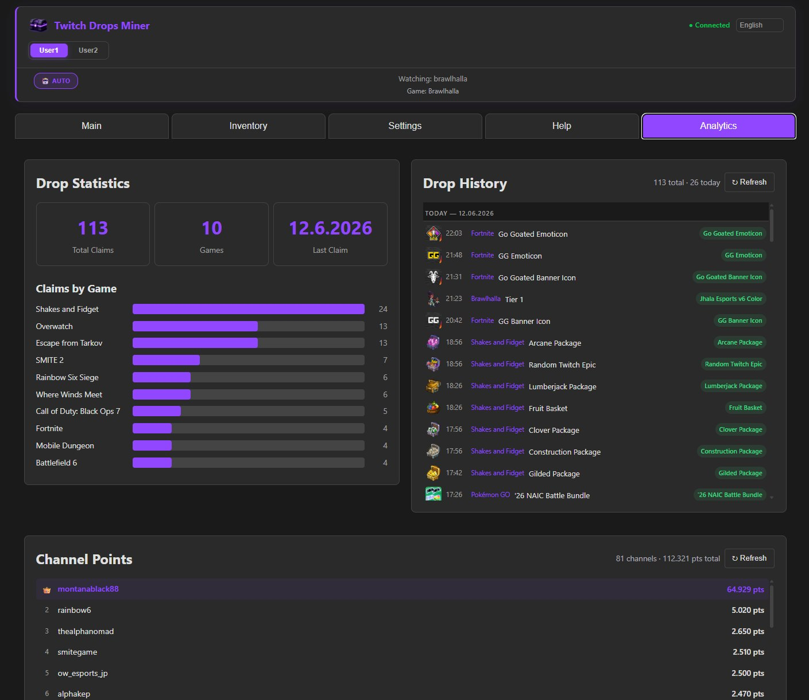
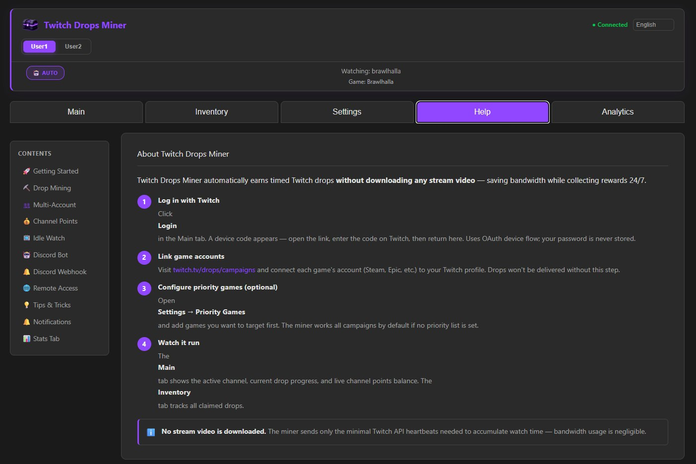
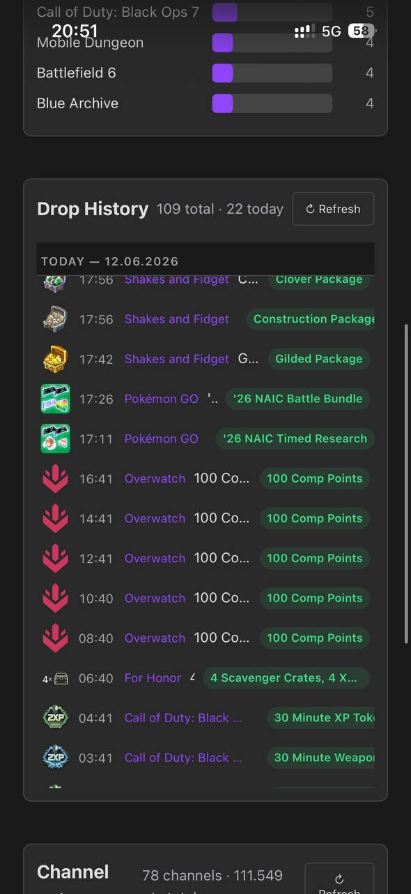

<p align="center">
  
</p>

<h1 align="center">🎮 Twitch Drops Miner — Owleague Edition</h1>

<p align="center">
  <strong>🤖 Automate Twitch Drop Farming — Zero Bandwidth, Maximum Efficiency</strong>
</p>

<p align="center">
  <a href="https://github.com/SimpliAj/twitchdropsminer/stargazers">
    
  </a>
  <a href="https://github.com/SimpliAj/twitchdropsminer/releases">
    
  </a>
  <a href="https://discord.gg/X5YKZBh9xV">
    
  </a>
  
  
</p>

---

## 📋 Overview

Twitch Drops Miner is a high-performance, multi-account automation tool designed to farm Twitch timed drops without downloading any stream video or audio data. It communicates directly with Twitch's internal GraphQL API and WebSocket pubsub system to simulate watch time, track drop progress, and automatically claim rewards — all while using a fraction of the bandwidth of a traditional browser-based approach.

Originally based on rangermix/TwitchDropsMiner, this fork has been completely rearchitected with a modern async/await codebase, a full web GUI, isolated multi-process account management, and extensive quality-of-life features. It is now an independent project with its own identity.

---

## ✨ Key Features

| Feature | Description |
|---------|-------------|
| 🚀 **Streamless Mining** | Uses Twitch GraphQL + WebSocket — zero video/audio download |
| 👥 **250+ Accounts** | Isolated OS processes per account — no GQL contention or event-loop saturation |
| 🌐 **Web GUI** | FastAPI + Socket.IO real-time dashboard accessible from any browser |
| 📊 **Live Analytics** | Real-time charts, drop tracking, and per-account progress monitoring |
| 🎯 **Auto Discovery** | Automatically finds active drop campaigns and tunes into qualifying channels |
| 🔄 **Smart Channel Switching** | Intelligent priority-based channel selection with viewer count fallback |
| 🛡 **Secure Auth** | OAuth Device Code Flow with persistent cookie storage + optional password protection |
| 🐳 **Docker Ready** | Single-container deployment with persistent data volumes |
| 🤖 **Discord Bot** | Remote monitoring and control via Discord commands and webhooks |
| 🎁 **Auto Claim** | Automatically claims completed drops as soon as they're ready |
| 🌙 **Idle Watch** | Monitor channels passively without active mining |
| 🏆 **Channel Points** | Built-in channel points auto-collector |
| 🌍 **19 Languages** | Full i18n support including Arabic, English, Chinese, Japanese, Russian, and more |
| 📱 **Mobile Friendly** | Responsive design works perfectly on phones and tablets |

---

## 📸 Screenshots

<p align="center">
  
  
</p>
<p align="center">
  
  
</p>
<p align="center">
  
</p>

---

## 🚀 Quick Start

### 🐳 Docker (Easiest)

```bash
docker run -d \
  --name twitch-drops-miner \
  -p 8080:8080 \
  -v ./data:/app/data \
  gitsimpliaj/twitch-drops-miner:latest
```

Open your browser at `http://localhost:8080`

### 📦 Run from Source

```bash
# Create virtual environment
python -m venv env
source env/bin/activate  # Linux/Mac
# .\env\Scripts\Activate  # Windows

# Install dependencies
pip install -e .

# Run
python main.py

# Verbose logging
python main.py -vvv
```

### 👥 Multi-Account Mode

Upload your `accounts.txt` through the web UI and the system automatically:
- Spawns isolated processes for each account (up to 50 concurrent, configurable to 500)
- Routes traffic through the correct data directories
- Collects and aggregates drop progress from all accounts
- Handles automatic restarts and process supervision

---

## 🖥️ Web Interface Tabs

| Tab | Purpose |
|-----|---------|
| 🏠 **Dashboard** | Live status, active drops, channel list with real-time updates |
| 📦 **Inventory** | All available drop campaigns with filtering and search |
| 💎 **Owned Drops** | Per-account drop tracking with progress, export, and filtering |
| ⚙️ **Settings** | Game selection, proxy config, language, channel overrides |
| 🤖 **Discord** | Bot integration for remote notifications and commands |

---

## 🏗️ Architecture

```
┌─ Primary Instance (port 8080) ─────────────────┐
│  ┌─ Web GUI (FastAPI + Socket.IO)             │
│  ├─ Auth State (OAuth token management)       │
│  ├─ GQL Client (GraphQL operations)           │
│  ├─ WebSocket Pool (50 topics/socket)         │
│  └─ Sibling Drops Collector (background)      │
├─ Sibling Account 2 (port 8082) ───────────────┤
│  ┌─ Independent Python process                │
│  ├─ Own event loop, GQL client, WebSocket     │
│  └─ Data: data/accounts/Account 2/data/       │
├─ Sibling Account 3 (port 8084) ───────────────┤
│  ... up to 250+ accounts                      │
└──────────────────────────────────────────────┘
```

### How It Works

1. **Primary instance** (port 8080) runs the web UI and manages account spawning
2. **Sibling processes** run as independent OS processes, each with their own event loop
3. **Background collector** periodically polls each sibling's GQL inventory and caches results
4. **WebSocket connections** are sharded (up to 50 topics per socket, max 199 channels) for real-time updates
5. **Watch payloads** (`sendSpadeEvents`) are sent periodically via GraphQL to simulate watch time

### State Machine Flow

```
IDLE → INVENTORY_FETCH → GAMES_UPDATE → CHANNELS_CLEANUP → CHANNELS_FETCH → CHANNEL_SWITCH → (loop)
```

---

## ⚙️ Tech Stack

```
🐍 Python 3.12+ (Async/Await Architecture)
⚡ FastAPI + Uvicorn (Web Server)
🔌 Socket.IO (Real-time Bidirectional Communication)
🎭 Twitch GraphQL API (Data Operations)
🌐 aiohttp (Async HTTP Client)
🔗 yarl (URL Handling)
📦 Docker + Docker Compose (Containerization)
🔐 OAuth 2.0 Device Code Flow (Authentication)
```

---

## 🔧 Requirements

- **Python 3.12+** (for source installation)
- **Docker** (for containerized deployment)
- **Twitch Account** (for OAuth authentication)

No GPU, no browser, no display server required.

---

## 🌐 Social & Links

<p align="center">
  <a href="https://github.com/SimpliAj/twitchdropsminer">
    
  </a>
  <a href="https://discord.gg/X5YKZBh9xV">
    
  </a>
  <a href="https://hub.docker.com/r/gitsimpliaj/twitch-drops-miner">
    
  </a>
</p>

---

## 🤝 Contributing

Contributions, issues, and feature requests are welcome!  
Feel free to check the [issues page](https://github.com/SimpliAj/twitchdropsminer/issues) or join the [Discord](https://discord.gg/X5YKZBh9xV).

---

## 📄 License

[MIT License](LICENSE) — Copyright © 2024-2026 DevilXD & SimpliAj

---

<p align="center">
  <sub>⭐ If you find this project useful, please give it a star on GitHub!</sub>
  <br>
  <sub>💬 Join the Discord server for support and community discussion</sub>
  <br>
  <sub>🛒 For account store inquiries: <strong>@owleague.store</strong></sub>
</p>
